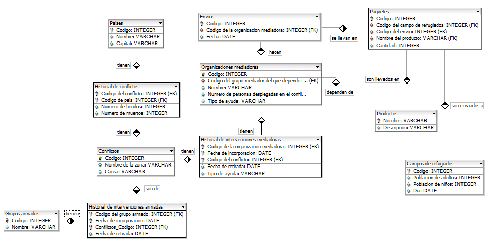

# ORACLE
# Fase 2: Creación de la Base de Datos. Carga de datos

* Script de creación de tablas y restrincciones [AQUÍ]()
* Script de inserción de datos [AQUÍ]()

## Creación de Tablas y Restrincciones:

#### Los tipos de datos y el tamaño de las columnas deben ser asignados correctamente por el alumno.



-------------------------------

#### Restrincciones Generales:

* Todas las claves primarias, ajenas y candidatas de todas las tablas.
* Las columnas que no puedan dejarse en blanco tendrán la correspondiente restricción
de obligatoriedad.

-------------------------------
### CONFLICTOS

##### Restrincciones:

* La causa de un conflicto será una de las siguientes: Racial, Económico, Religioso o
Desconocida.

``` sql

CREATE TABLE conflictos (
    codigo          VARCHAR2(3),
    nombre          VARCHAR2(50),
    causa           VARCHAR2(15),
    CONSTRAINT pk_codigo_conflictos PRIMARY KEY(codigo),
    CONSTRAINT causa_seleccion CHECK(upper(causa) in ('RACIAL','ECONOMICO','RELIGIOSO','DESCONOCIDA')),
    CONSTRAINT notnull_nombreconfl CHECK(nombre IS NOT NULL),
    CONSTRAINT unique_nombreconfl UNIQUE(nombre)
);
```
-------------------------------
### PAISES

##### Restrincciones:
* El código de país incluye una letra que indica el continente y dos dígitos para indicar
el número de orden alfabético del país dentro de dicho continente.

``` sql
CREATE TABLE paises (
    codigo                  VARCHAR2(5),
    nombre                  VARCHAR2(30),
    capital                 VARCHAR2(30),
    CONSTRAINT pk_codigo_paises PRIMARY KEY(codigo),
    CONSTRAINT cod_letrapais_dosdig CHECK (REGEXP_LIKE(codigo, '^[A-Z]{2}[0-9]{2}$','c') AND SUBSTR(codigo,1,2) in ('EU','AS','AF','NA','SA','OC','AN')),
    CONSTRAINT notnull_nombrepais CHECK(nombre IS NOT NULL),
    CONSTRAINT unique_nombrepais UNIQUE(nombre)
);
```
-------------------------------
### Historial de Conflictos

##### Restrincciones:
* Cuando se introducen los datos de un nuevo conflicto el número de heridos y muertos
será 0 a no ser que se especifique lo contrario.

``` sql
CREATE TABLE historial_de_conflictos (
    codigo_conflicto        VARCHAR2(3),
    codigo_pais             VARCHAR2(5),
    num_heridos             NUMBER(6) DEFAULT 0,
    num_muertos             NUMBER(6) DEFAULT 0,
    CONSTRAINT pk_codconflicto_codpais PRIMARY KEY(codigo_conflicto,codigo_pais),
    CONSTRAINT fk_cod_conflicto FOREIGN KEY(codigo_conflicto) REFERENCES conflictos(codigo),
    CONSTRAINT fk_cod_pais FOREIGN KEY(codigo_pais) REFERENCES paises(codigo)
);
```
-------------------------------
### Grupos Armados

##### Restrincciones:
* El código de un grupo armado está compuesto de una letra que será A, B o C, un
guión y entre uno y tres dígitos.

``` sql
CREATE TABLE grupos_armados (
    codigo                  VARCHAR2(5),
    nombre                  VARCHAR2(50),
    CONSTRAINT pk_codigo_gruparmados PRIMARY KEY(codigo),
    CONSTRAINT codigo_ABC CHECK(REGEXP_LIKE(codigo, '^[ABC]-[0-9]{1,3}$', 'c')),
    CONSTRAINT notnull_nombregrup CHECK(nombre IS NOT NULL),
    CONSTRAINT unique_nombregrup UNIQUE(nombre)
);
```
-------------------------------
### Historial de Intervenciones Armadas

##### Restrincciones:
* Las fechas de incorporación de un grupo armado a un conflicto son siempre
posteriores a Abril de 2001.

``` sql
CREATE TABLE his_intervenciones_armadas (
    codigo_gruparmado       VARCHAR2(5),
    codigo_conflicto        VARCHAR2(3),
    fecha_incorporacion     DATE,
    fecha_retirada          DATE,
    CONSTRAINT pk_codgruparm_codconf_fecha PRIMARY KEY(codigo_gruparmado,codigo_conflicto,fecha_incorporacion),
    CONSTRAINT fk_cod_gruparmado_armadas FOREIGN KEY(codigo_gruparmado) REFERENCES grupos_armados(codigo),
    CONSTRAINT fk_cod_conflicto_armadas FOREIGN KEY(codigo_conflicto) REFERENCES conflictos(codigo),
    CONSTRAINT mas_abril2001 CHECK(to_char(fecha_incorporacion, 'YYYY/MM') > '2001/04')
);
```
-------------------------------
### Organizaciones

##### Restrincciones:
* Los nombres de las organizaciones se almacenarán con la inicial de cada palabra en
mayúsculas.

``` sql
CREATE TABLE organizaciones (
    codigo                  VARCHAR2(3),
    codigo_orgdepen         VARCHAR2(3),
    nombre                  VARCHAR2(30),
    numpersonas_conflicto   NUMBER(3),
    tipo                    VARCHAR2(30),
    CONSTRAINT pk_codigo_organizaciones PRIMARY KEY(codigo),
    CONSTRAINT fk_codigo_orgdepend FOREIGN KEY(codigo_orgdepen) REFERENCES organizaciones(codigo),
    CONSTRAINT iniciales_mayus CHECK(nombre = INITCAP(nombre)),
    CONSTRAINT notnull_nombreorg CHECK(nombre IS NOT NULL),
    CONSTRAINT notnull_tipoorg CHECK(tipo IS NOT NULL),
    CONSTRAINT unique_nombreorg UNIQUE(nombre)
);
```
-------------------------------
### Historial de Intervenciones Mediadoras

``` sql
CREATE TABLE his_intervenciones_mediadoras (
    codigo_org              VARCHAR2(3),
    codigo_conflicto        VARCHAR2(3),
    fecha_incorporacion     DATE,
    fecha_retirada          DATE,
    tipo_ayuda              VARCHAR2(30),
    CONSTRAINT pk_orga_conflitos_fecha PRIMARY KEY(codigo_org,codigo_conflicto,fecha_incorporacion),
    CONSTRAINT fk_cod_orga FOREIGN KEY(codigo_org) REFERENCES organizaciones(codigo),
    CONSTRAINT fk_cod_conflictos FOREIGN KEY(codigo_conflicto) REFERENCES conflictos(codigo)
);
```
-------------------------------
### Envios
##### Restrincciones:
* Los envíos se realizan siempre entre las ocho de la mañana y las cuatro de la tarde.
* Los envíos se realizan siempre el día 1 ó 15 de cada mes.

``` sql
CREATE TABLE envios (
    codigo                  VARCHAR2(3),
    codigo_org              VARCHAR2(3),
    fecha_hora              DATE,
    CONSTRAINT pk_codigo_envios PRIMARY KEY(codigo),
    CONSTRAINT fk_cod_org FOREIGN KEY(codigo_org) REFERENCES organizaciones(codigo),
    CONSTRAINT entre8_16 CHECK(to_char(fecha_hora, 'HH24:MI') between '08:00' and '16:00'),
    CONSTRAINT dia1_15 CHECK(to_char(fecha_hora, 'DD') = '01' OR to_char(fecha_hora, 'DD') = '15')
);
```
-------------------------------
### Productos

``` sql
CREATE TABLE productos (
    nombre                  VARCHAR2(20),
    descripcion             VARCHAR2(100),
    CONSTRAINT pk_nombre_productos PRIMARY KEY(nombre)
);
```
-------------------------------
### Campos de Refugiados

``` sql
CREATE TABLE campos_refugiados (
    codigo                  VARCHAR2(3),
    nombre                  VARCHAR2(30),
    zona_asentamiento       VARCHAR2(50),
    CONSTRAINT  pk_codigo_camprefugiados PRIMARY KEY(codigo),
    CONSTRAINT notnull_nombrecamp CHECK(nombre IS NOT NULL),
    CONSTRAINT notnull_zonacamp CHECK(zona_asentamiento IS NOT NULL),
    CONSTRAINT unique_nombrcamp UNIQUE(nombre)
);
```
-------------------------------
### Paquetes


``` sql
CREATE TABLE paquetes  (
    codigo                  VARCHAR2(3),
    codigo_refugio       VARCHAR2(3),
    codigo_envio            VARCHAR2(3),
    nombre_producto         VARCHAR2(30),
    cantidad                NUMBER(4),
    CONSTRAINT pk_codigo_paquetes PRIMARY KEY(codigo),
    CONSTRAINT fk_cod_refugiados FOREIGN KEY(codigo_refugio) REFERENCES campos_refugiados(codigo),
    CONSTRAINT fk_cod_envio FOREIGN KEY(codigo_envio) REFERENCES envios(codigo),
    CONSTRAINT fk_nombre_productos FOREIGN KEY(nombre_producto) REFERENCES productos(nombre),
    CONSTRAINT notnull_cantidadpaquete CHECK(cantidad IS NOT NULL)
);
```
-------------------------------
### Refugiados

``` sql
CREATE TABLE refugiados (
    codigo                  VARCHAR2(4),
    codigo_refugio          VARCHAR2(4),
    nombre                  VARCHAR2(40),
    edad                    NUMERIC(3),
    fecha_llegada           DATE,
    fecha_salida            DATE,
    CONSTRAINT pk_refugiado_refugio PRIMARY KEY(codigo,codigo_refugio),
    CONSTRAINT notnull_nombrerefug CHECK(nombre IS NOT NULL),
    CONSTRAINT notnull_edadrefug CHECK(edad IS NOT NULL)
);
```
-------------------------------

## Inserción de Datos

* La carga de datos debe realizarse con datos consistentes y cumpliendo todas las
restricciones. La cantidad mínima de datos en cada una de las tablas viene detallada a
continuación:

|       Nombre Tabla                       |  Nº Mínimo Registros  |
|:----------------------------------------:|:---------------------:|
|Países                                    |     8                 |
|Conflictos                                |     9                 | 
|Grupos Armados                            |     5                 |
|Historial de Conflictos                   |     10                |
|Historial de intervenciones armadas       |     10                |
|Organizaciones mediadoras                 |     6                 |
|Historial de intervenciones mediadoras    |     10                |
|Envíos                                    |     12                |
|Paquetes                                  |     20                |
|Productos                                 |     10                |
|Campos de refugiados                      |     6                 |


### CONFLICTOS

##### Inserción de datos:

``` sql
INSERT INTO conflictos VALUES ('1','La guerra de Afganistan','Racial');
INSERT INTO conflictos VALUES ('2','Campaña Nacional','Economico');
INSERT INTO conflictos VALUES ('3','La guerra civil de Sudan del Sur','Religioso');
INSERT INTO conflictos VALUES ('4','La guerra civil de Myanmar','Religioso');
INSERT INTO conflictos VALUES ('5','La guerra de Biafra','Economico');
INSERT INTO conflictos VALUES ('6','Segunda guerra del Golfo','Religioso');
INSERT INTO conflictos VALUES ('7','Guerra civil de Siria','Racial');
INSERT INTO conflictos VALUES ('8','La guerra civil de Yemen','Desconocida');
INSERT INTO conflictos VALUES ('9','La guerra civil somali','Economico');
INSERT INTO conflictos VALUES ('10','Conflicto del Delta del Niger','Economico');
```

##### Comprobación de las restrincciones:

``` sql
INSERT INTO conflictos VALUES ('1','La guerra de Afganistan','Racial');
--1 row created.
INSERT INTO conflictos VALUES ('1','La guerra de Afganistan','Racia');     
--ERROR at line 1:
--ORA-02290: check constraint (MORALG.CAUSA_SELECCION) violated
INSERT INTO conflictos VALUES ('1','La guerra de Afganistan','Racial');
--ERROR at line 1:
--ORA-00001: unique constraint (MORALG.PK_CODIGO_CONFLICTOS) violated
```
-------------------------------
### PAISES

##### Inserción de datos:

``` sql
INSERT INTO paises VALUES ('AS01','Afganistan','Kabul');
INSERT INTO paises VALUES ('AS43','Turquia','Ankara');
INSERT INTO paises VALUES ('AF49','Sudan del Sur','Yuba');
INSERT INTO paises VALUES ('AS32','Myanmar','Naipyidó');
INSERT INTO paises VALUES ('AF38','Nigeria','Abuya');
INSERT INTO paises VALUES ('AS19','Irak','Bagdad');
INSERT INTO paises VALUES ('AS38','Siria','Damasco');
INSERT INTO paises VALUES ('AS46','Yemen','Sana');
INSERT INTO paises VALUES ('AF46','Somalia','Mogadiscio');
```

##### Comprobación de las restrincciones:

``` sql
INSERT INTO paises VALUES ('AS93','Afganistan','Kabul');
--1 row created.
INSERT INTO paises VALUES ('A093','Afganistan','Kabul');
--ERROR at line 1:
--ORA-02290: check constraint (MORALG.COD_LETRAPAIS_DOSDIG) violated
INSERT INTO paises VALUES ('093','Afganistan','Kabul');
--ERROR at line 1:
--ORA-02290: check constraint (MORALG.COD_LETRAPAIS_DOSDIG) violated
INSERT INTO paises VALUES ('AT93','Afganistan','Kabul');
--ERROR at line 1:
--ORA-02290: check constraint (MORALG.COD_LETRAPAIS_DOSDIG) violated
INSERT INTO paises VALUES ('as093','Afganistan','Kabul');
--1 row created.
INSERT INTO paises VALUES ('AS934','Afganistan','Kabul');
--ERROR at line 1:
--ORA-02290: check constraint (MORALG.COD_LETRAPAIS_DOSDIG) violated
INSERT INTO paises VALUES ('ASD093','Afganistan','Kabul');
--ERROR at line 1:
--ORA-02290: check constraint (MORALG.COD_LETRAPAIS_DOSDIG) violated
INSERT INTO paises VALUES ('AS093','Afganistan','Kabul');
--ERROR at line 1:
--ORA-00001: unique constraint (MORALG.PK_CODIGO_PAISES) violated
```
-------------------------------
### Historial de Conflictos

##### Inserción de datos:

``` sql
INSERT INTO historial_de_conflictos VALUES ('1','AS01','50','35012');
INSERT INTO historial_de_conflictos(codigo_conflicto, codigo_pais, num_heridos) VALUES ('2','AS43','20000');
INSERT INTO historial_de_conflictos VALUES ('3','AF49','120000','70000');
INSERT INTO historial_de_conflictos VALUES ('4','AS32','30000','20000');
INSERT INTO historial_de_conflictos(codigo_conflicto, codigo_pais, num_muertos) VALUES ('5','AF46','25000');
INSERT INTO historial_de_conflictos VALUES ('6','AS38','67500','50000');
INSERT INTO historial_de_conflictos VALUES ('7','AS46','200000','100000');
INSERT INTO historial_de_conflictos VALUES ('8','AS19','12000','6000');
INSERT INTO historial_de_conflictos(codigo_conflicto, codigo_pais, num_muertos) VALUES ('9','AF38','15000');
INSERT INTO historial_de_conflictos VALUES ('10','AF46','400','80');

INSERT INTO historial_de_conflictos VALUES ('1','AF49','120000','70000');
INSERT INTO historial_de_conflictos(codigo_conflicto, codigo_pais) VALUES ('7','AF46');
```

##### Comprobación de las restrincciones:

``` sql
INSERT INTO historial_de_conflictos VALUES ('1','AS093','70000','35000');
--1 row created.
INSERT INTO historial_de_conflictos VALUES ('1','AS093','70000','35000');
--ERROR at line 1:
--ORA-00001: unique constraint (MORALG.PK_CODCONFLICTO_CODPAIS) violated
INSERT INTO historial_de_conflictos(codigo_conflicto,codigo_pais,num_heridos) VALUES ('2','EU090','70000');
--1 row created.
SELECT * FROM historial_de_conflictos;

--CODIGO_CON CODIGO_PAI NUM_HERIDOS NUM_MUERTOS
------------ ---------- ----------- -----------
--1	   AS093	    70000	35000
--2	   EU090	    70000	    0
```
-------------------------------
### Grupos Armados

##### Inserción de datos:

``` sql
INSERT INTO grupos_armados VALUES ('A-111','Ponchos Rojos');
INSERT INTO grupos_armados VALUES ('B-111','Legion Blanca');
INSERT INTO grupos_armados VALUES ('C-111','Monadire');
INSERT INTO grupos_armados VALUES ('A-222','Milicia Urbana');
INSERT INTO grupos_armados VALUES ('B-222','NSKK');
INSERT INTO grupos_armados VALUES ('C-222','Movimiento Liberacion de Sudan');
INSERT INTO grupos_armados VALUES ('A-333','Los Rastrojos');
INSERT INTO grupos_armados VALUES ('B-333','Legion Nauvoo');
INSERT INTO grupos_armados VALUES ('C-333','Legion Al-Rahman'); --
INSERT INTO grupos_armados VALUES ('A-444','Kamajoh');
INSERT INTO grupos_armados VALUES ('B-444','Werwolf');
INSERT INTO grupos_armados VALUES ('C-444','Resistencia Nacional');
```

##### Comprobación de las restrincciones:

``` sql
INSERT INTO grupos_armados VALUES ('A-111','Ponchos Rojos');
--1 row created.
INSERT INTO grupos_armados VALUES ('AA-111','Ponchos Rojos');
--ERROR at line 1:
--ORA-02290: check constraint (MORALG.CODIGO_ABC) violated
INSERT INTO grupos_armados VALUES ('D-111','Ponchos Rojos');
--ERROR at line 1:
--ORA-02290: check constraint (MORALG.CODIGO_ABC) violated
INSERT INTO grupos_armados VALUES ('A111','Ponchos Rojos');
--ERROR at line 1:
--ORA-02290: check constraint (MORALG.CODIGO_ABC) violated
INSERT INTO grupos_armados VALUES ('A-1111','Ponchos Rojos');
--ERROR at line 1:
--ORA-02290: check constraint (MORALG.CODIGO_ABC) violated
INSERT INTO grupos_armados VALUES ('1A-111','Ponchos Rojos');
--ERROR at line 1:
--ORA-02290: check constraint (MORALG.CODIGO_ABC) violated
INSERT INTO grupos_armados VALUES ('A-111','Ponchos Rojos');
--ERROR at line 1:
--ORA-00001: unique constraint (MORALG.PK_CODIGO_GRUPARMADOS) violated
```
-------------------------------
### Historial de Intervenciones Armadas

##### Inserción de datos:

``` sql
INSERT INTO his_intervenciones_armadas(codigo_gruparmado,codigo_conflicto,fecha_incorporacion) VALUES ('B-333','5',to_date('12/05/2002','DD/MM/YYYY'));
INSERT INTO his_intervenciones_armadas(codigo_gruparmado,codigo_conflicto,fecha_incorporacion) VALUES ('B-444','10',to_date('30/01/2002','DD/MM/YYYY'));
INSERT INTO his_intervenciones_armadas(codigo_gruparmado,codigo_conflicto,fecha_incorporacion) VALUES ('A-111','1',to_date('23/09/2004','DD/MM/YYYY'));
INSERT INTO his_intervenciones_armadas(codigo_gruparmado,codigo_conflicto,fecha_incorporacion) VALUES ('B-111','2',to_date('09/12/2004','DD/MM/YYYY'));
INSERT INTO his_intervenciones_armadas(codigo_gruparmado,codigo_conflicto,fecha_incorporacion) VALUES ('C-111','3',to_date('01/10/2001','DD/MM/YYYY'));
INSERT INTO his_intervenciones_armadas(codigo_gruparmado,codigo_conflicto,fecha_incorporacion) VALUES ('A-222','4',to_date('27/08/2001','DD/MM/YYYY'));
INSERT INTO his_intervenciones_armadas(codigo_gruparmado,codigo_conflicto,fecha_incorporacion) VALUES ('B-222','5',to_date('30/05/2003','DD/MM/YYYY'));
INSERT INTO his_intervenciones_armadas(codigo_gruparmado,codigo_conflicto,fecha_incorporacion) VALUES ('C-222','6',to_date('23/11/2004','DD/MM/YYYY'));
INSERT INTO his_intervenciones_armadas(codigo_gruparmado,codigo_conflicto,fecha_incorporacion) VALUES ('A-333','7',to_date('02/07/2003','DD/MM/YYYY'));
INSERT INTO his_intervenciones_armadas VALUES ('C-333','8',to_date('30/05/2001','DD/MM/YYYY'),to_date('14/02/2005','DD/MM/YYYY'));
INSERT INTO his_intervenciones_armadas VALUES ('C-333','9',to_date('29/05/2003','DD/MM/YYYY'),to_date('27/08/2007','DD/MM/YYYY'));
INSERT INTO his_intervenciones_armadas(codigo_gruparmado,codigo_conflicto,fecha_incorporacion) VALUES ('A-444','10',to_date('03/06/2001','DD/MM/YYYY'));
INSERT INTO his_intervenciones_armadas(codigo_gruparmado,codigo_conflicto,fecha_incorporacion) VALUES ('C-444','10',to_date('17/08/2006','DD/MM/YYYY'));

INSERT INTO his_intervenciones_armadas(codigo_gruparmado,codigo_conflicto,fecha_incorporacion) VALUES ('C-444','1',to_date('17/08/2006','DD/MM/YYYY'));
```

##### Comprobación de las restrincciones:

``` sql
INSERT INTO his_intervenciones_armadas(codigo_gruparmado,codigo_conflicto,fecha_incorporacion) VALUES ('B-333','5',to_date('12/05/2002','DD/MM/YYYY'));
--1 row created.
INSERT INTO his_intervenciones_armadas(codigo_gruparmado,codigo_conflicto,fecha_incorporacion) VALUES ('B-333','5',to_date('12/04/2001','DD/MM/YYYY'));
--ERROR at line 1:
--ORA-02290: check constraint (MORALG.MAS_ABRIL2001) violated
INSERT INTO his_intervenciones_armadas(codigo_gruparmado,codigo_conflicto,fecha_incorporacion) VALUES ('B-333','5',to_date('30/04/2001','DD/MM/YYYY'));
--ERROR at line 1:
--ORA-02290: check constraint (MORALG.MAS_ABRIL2001) violated
INSERT INTO his_intervenciones_armadas(codigo_gruparmado,codigo_conflicto,fecha_incorporacion) VALUES ('B-333','5',to_date('31/04/2001','DD/MM/YYYY'));
--ERROR at line 1:
--ORA-01830: date format picture ends before converting entire input string
INSERT INTO his_intervenciones_armadas(codigo_gruparmado,codigo_conflicto,fecha_incorporacion) VALUES ('B-333','5',to_date('01/05/2001','DD/MM/YYYY'));
--1 row created.
INSERT INTO his_intervenciones_armadas(codigo_gruparmado,codigo_conflicto,fecha_incorporacion) VALUES ('B-333','5',to_date('01/05/2001','DD/MM/YYYY'));
--ERROR at line 1:
--ORA-00001: unique constraint (MORALG.PK_CODGRUPARM_CODCONF_FECHA) violated

```
-------------------------------
### Organizaciones

##### Inserción de datos:

``` sql
INSERT INTO organizaciones(codigo,nombre,numpersonas_conflicto,tipo) VALUES ('2','Soleil De Afrique','40','Accion Humanitaria');
INSERT INTO organizaciones(codigo,nombre,numpersonas_conflicto,tipo) VALUES ('5','Accion Humana','70','Accion Humanitaria');
INSERT INTO organizaciones(codigo,nombre,numpersonas_conflicto,tipo) VALUES ('6','Accion Verapaz','40','Accion Humanitaria');
INSERT INTO organizaciones VALUES ('4','6','Accion Solidaria','200','Accion Humanitaria');
INSERT INTO organizaciones VALUES ('3','4','Accem','60','Incidencia Politica');
INSERT INTO organizaciones VALUES ('1','2','Luchemos Por La Vida','130','Proyectos de Desarrollo');
```

##### Comprobación de las restrincciones:

``` sql
INSERT INTO organizaciones(codigo,nombre,numpersonas_conflicto,tipo) VALUES ('2','Soleil De Afrique','40','Accion Humanitaria');
--1 row created.
INSERT INTO organizaciones(codigo,nombre,numpersonas_conflicto,tipo) VALUES ('2','Soleil De afrique','40','Accion Humanitaria');
--ERROR at line 1:
--ORA-02290: check constraint (MORALG.INICIALES_MAYUS) violated
INSERT INTO organizaciones(codigo,nombre,numpersonas_conflicto,tipo) VALUES ('2','Soleil De AFrique','40','Accion Humanitaria');
--ERROR at line 1:
--ORA-02290: check constraint (MORALG.INICIALES_MAYUS) violated
INSERT INTO organizaciones(codigo,nombre,numpersonas_conflicto,tipo) VALUES ('2','SOLEIL De Afrique','40','Accion Humanitaria');
--ERROR at line 1:
--ORA-02290: check constraint (MORALG.INICIALES_MAYUS) violated
INSERT INTO organizaciones(codigo,nombre,numpersonas_conflicto,tipo) VALUES ('2','Soleil De Afrique','40','Accion Humanitaria');
--ERROR at line 1:
--ORA-00001: unique constraint (MORALG.PK_CODIGO_ORGANIZACIONES) violated
```
-------------------------------
### Historial de Intervenciones Mediadoras

##### Inserción de datos:

``` sql
INSERT INTO his_intervenciones_mediadoras(codigo_org,codigo_conflicto,fecha_incorporacion,tipo_ayuda) VALUES ('1','4','12/05/2001','Trabajo social');
INSERT INTO his_intervenciones_mediadoras(codigo_org,codigo_conflicto,fecha_incorporacion,tipo_ayuda) VALUES ('2','5','02/07/2003','Trabajo socila');
INSERT INTO his_intervenciones_mediadoras VALUES ('3','8','30/03/1995','14/02/2005','Trabajo de transporte');
INSERT INTO his_intervenciones_mediadoras(codigo_org,codigo_conflicto,fecha_incorporacion,tipo_ayuda) VALUES ('4','7','03/02/2001','Trabajo de transporte');
INSERT INTO his_intervenciones_mediadoras(codigo_org,codigo_conflicto,fecha_incorporacion,tipo_ayuda) VALUES ('5','2','17/08/2000','Representante intermediario');
INSERT INTO his_intervenciones_mediadoras VALUES ('6','9','29/05/1997','27/08/2007','Trabajo social');
INSERT INTO his_intervenciones_mediadoras(codigo_org,codigo_conflicto,fecha_incorporacion,tipo_ayuda) VALUES ('1','10','23/09/2004','Trabajo de social');
INSERT INTO his_intervenciones_mediadoras(codigo_org,codigo_conflicto,fecha_incorporacion,tipo_ayuda) VALUES ('4','2','1/10/1997','Representante intermediario');
INSERT INTO his_intervenciones_mediadoras VALUES ('4','9','29/12/1997','27/08/2007','Trabajo de transporte');
INSERT INTO his_intervenciones_mediadoras(codigo_org,codigo_conflicto,fecha_incorporacion,tipo_ayuda) VALUES ('1','7','05/04/1998','Trabajo social');
```

-------------------------------
### Envios

##### Inserción de datos:

``` sql
INSERT INTO envios VALUES ('1','1',to_date('15/08/2003 13:30','DD/MM/YYYY HH24:MI'));
INSERT INTO envios VALUES ('2','2',to_date('01/05/2000 12:45','DD/MM/YYYY HH24:MI'));
INSERT INTO envios VALUES ('3','3',to_date('01/05/1999 13:23','DD/MM/YYYY HH24:MI'));
INSERT INTO envios VALUES ('4','4',to_date('15/09/2008 15:00','DD/MM/YYYY HH24:MI'));
INSERT INTO envios VALUES ('5','5',to_date('15/10/1997 09:25','DD/MM/YYYY HH24:MI'));
INSERT INTO envios VALUES ('6','6',to_date('15/12/1999 10:15','DD/MM/YYYY HH24:MI'));
INSERT INTO envios VALUES ('7','4',to_date('01/04/2005 09:45','DD/MM/YYYY HH24:MI'));
INSERT INTO envios VALUES ('8','6',to_date('01/05/2003 11:30','DD/MM/YYYY HH24:MI'));
INSERT INTO envios VALUES ('9','4',to_date('01/07/2009 10:25','DD/MM/YYYY HH24:MI'));
INSERT INTO envios VALUES ('10','3',to_date('15/02/2005 10:35','DD/MM/YYYY HH24:MI'));
INSERT INTO envios VALUES ('11','3',to_date('01/08/2007 12:00','DD/MM/YYYY HH24:MI'));
INSERT INTO envios VALUES ('12','5',to_date('15/05/2008 12:45','DD/MM/YYYY HH24:MI'));
```

##### Comprobación de las restrincciones:

``` sql
INSERT INTO envios VALUES ('1','1','15/08/2003 08:00');
--INSERT 0 1
INSERT INTO envios VALUES ('1','1',to_date('15/08/2003 7:59','DD/MM/YYYY HH24:MI'));
--ERROR:  el nuevo registro para la relación «envios» viola la restricción «check» «entre8_16»
--DETALLE:  La fila que falla contiene (1, 1, 2003-08-15 07:59:00).
INSERT INTO envios VALUES ('1','1',to_date('15/08/2003 7:00','DD/MM/YYYY HH24:MI'));
--ERROR:  el nuevo registro para la relación «envios» viola la restricción «check» «entre8_16»
--DETALLE:  La fila que falla contiene (1, 1, 2003-08-15 07:00:00).
INSERT INTO envios VALUES ('1','1',to_date('15/08/2003 16:01','DD/MM/YYYY HH24:MI'));
--ERROR:  el nuevo registro para la relación «envios» viola la restricción «check» «entre8_16»
--DETALLE:  La fila que falla contiene (1, 1, 2003-08-15 16:01:00).
INSERT INTO envios VALUES ('1','1',to_date('15/08/2003 16:10','DD/MM/YYYY HH24:MI'));
--ERROR:  el nuevo registro para la relación «envios» viola la restricción «check» «entre8_16»
--DETALLE:  La fila que falla contiene (1, 1, 2003-08-15 16:10:00).
INSERT INTO envios VALUES ('1','1',to_date('15/08/2003 13:00','DD/MM/YYYY HH24:MI'));
--ERROR:  llave duplicada viola restricción de unicidad «pk_codigo_envios»
--DETALLE:  Ya existe la llave (codigo)=(1).
```

##### Comprobación de las restrincciones:

``` sql
INSERT INTO envios VALUES ('1','1',to_date('15/08/2003 8:30','DD/MM/YYYY HH24:MI'));
--INSERT 0 1
INSERT INTO envios VALUES ('1','1',to_date('14/08/2003 8:30','DD/MM/YYYY HH24:MI'));
--ERROR:  el nuevo registro para la relación «envios» viola la restricción «check» «dia1_15»
--DETALLE:  La fila que falla contiene (1, 1, 2003-08-14 08:30:00).
INSERT INTO envios VALUES ('1','1',to_date('16/08/2003 8:30','DD/MM/YYYY HH24:MI'));
--ERROR:  el nuevo registro para la relación «envios» viola la restricción «check» «dia1_15»
--DETALLE:  La fila que falla contiene (1, 1, 2003-08-16 08:30:00).
INSERT INTO envios VALUES ('1','1',to_date('02/08/2003 8:30','DD/MM/YYYY HH24:MI'));
--ERROR:  el nuevo registro para la relación «envios» viola la restricción «check» «dia1_15»
--DETALLE:  La fila que falla contiene (1, 1, 2003-08-02 08:30:00).
INSERT INTO envios VALUES ('1','1',to_date('31/08/2003 8:30','DD/MM/YYYY HH24:MI'));
--ERROR:  el nuevo registro para la relación «envios» viola la restricción «check» «dia1_15»
--DETALLE:  La fila que falla contiene (1, 1, 2003-08-31 08:30:00).
```
-------------------------------
### Productos

##### Inserción de datos:

``` sql
INSERT INTO productos VALUES ('Legumbres','Alimento, alto contenido en proteinas (sacos de 10 Kg)');
INSERT INTO productos VALUES ('Cereales','Alimento, alto contenido de carbohidratos (cajas de 500g)');
INSERT INTO productos VALUES ('Sal','Ayuda alimentaria (Paquetes de 5 Kg)');
INSERT INTO productos VALUES ('Azucar','Ayuda alimentaria, alto contenido calorico (paquetes de 5 Kg)');
INSERT INTO productos VALUES ('Pescado','Alimento, alto contenido en proteinas (por piezas)');
INSERT INTO productos VALUES ('Carne Enlatada','Alimento, alto contenido en proteninas (Por latas)');
INSERT INTO productos VALUES ('Agua','Esencial para vivir (garrafas de 50 L)');
INSERT INTO productos VALUES ('Aceite','Ayuda alimentaria, alto contenido calorico (garrafas de 20L)');
INSERT INTO productos VALUES ('Calzado','Proteccion para el cuerpo (por pares)');
INSERT INTO productos VALUES ('Juguetes','Ayuda para el anime de los niños (por unidades)');
```

-------------------------------
### Campos de Refugiados

##### Inserción de datos:

``` sql
INSERT INTO campos_refugiados VALUES ('1','Dadaab','Hagadera');
INSERT INTO campos_refugiados VALUES ('2','Dollo Ado','Eritrea');
INSERT INTO campos_refugiados VALUES ('3','Kakuma','Sur de Kenia');
INSERT INTO campos_refugiados VALUES ('4','Jabalia','Gaza');
INSERT INTO campos_refugiados VALUES ('5','Al Zaatari','Jordania');
INSERT INTO campos_refugiados VALUES ('6','Katumba','Tanzania');
INSERT INTO campos_refugiados VALUES ('7','Panian','Norte de Pakistan');
INSERT INTO campos_refugiados VALUES ('8','Yida','Sudan del Sur');
```

-------------------------------
### Paquetes


##### Inserción de datos:

``` sql
INSERT INTO paquetes VALUES ('1','1','1','Legumbres',10);
INSERT INTO paquetes VALUES ('2','1','1','Cereales',50);
INSERT INTO paquetes VALUES ('3','2','2','Sal',20);
INSERT INTO paquetes VALUES ('4','3','3','Sal',20);
INSERT INTO paquetes VALUES ('5','4','4','Azucar',20);
INSERT INTO paquetes VALUES ('6','5','5','Pescado',30);
INSERT INTO paquetes VALUES ('7','6','6','Carne Enlatada',100);
INSERT INTO paquetes VALUES ('8','6','6','Agua',20);
INSERT INTO paquetes VALUES ('9','7','7','Agua',20);
INSERT INTO paquetes VALUES ('10','8','8','Agua',30);
INSERT INTO paquetes VALUES ('11','8','8','Calzado',100);
INSERT INTO paquetes VALUES ('12','4','4','Juguetes',40);
INSERT INTO paquetes VALUES ('13','5','9','Legumbres',20);
INSERT INTO paquetes VALUES ('14','3','10','Legumbres',20);
INSERT INTO paquetes VALUES ('15','2','11','Cereales',50);
INSERT INTO paquetes VALUES ('16','7','12','Sal',30);
```

-------------------------------

### Refugiados

##### Inserción de datos:

``` sql
INSERT INTO Refugiados(codigo,codigo_refugio,nombre,edad,fecha_llegada) VALUES ('1','1','Muminah Hawazin Aswad','18',                           to_date('17/08/2000','DD/MM/YYYY'));
INSERT INTO Refugiados(codigo,codigo_refugio,nombre,edad,fecha_llegada) VALUES ('2','1','Ghayda Jawna Mansour','34',                            to_date('17/08/2000','DD/MM/YYYY'));
INSERT INTO Refugiados(codigo,codigo_refugio,nombre,edad,fecha_llegada) VALUES ('3','1','Najla Nafisah Sarkis','65',                            to_date('17/08/2000','DD/MM/YYYY'));
INSERT INTO Refugiados(codigo,codigo_refugio,nombre,edad,fecha_llegada) VALUES ('4','1','Wasfiyah Nadiyah Amari','23',                          to_date('17/08/2000','DD/MM/YYYY'));
INSERT INTO Refugiados(codigo,codigo_refugio,nombre,edad,fecha_llegada) VALUES ('5','1','Niyaf Layan Bishara','45',                             to_date('17/08/2000','DD/MM/YYYY'));
INSERT INTO Refugiados(codigo,codigo_refugio,nombre,edad,fecha_llegada) VALUES ('6','1','Fatimah Tibah Tahan','56',                             to_date('17/08/2000','DD/MM/YYYY'));
INSERT INTO Refugiados(codigo,codigo_refugio,nombre,edad,fecha_llegada) VALUES ('7','1','Rubaa Khawlah Bata','23',                              to_date('17/08/2000','DD/MM/YYYY'));
INSERT INTO Refugiados(codigo,codigo_refugio,nombre,edad,fecha_llegada) VALUES ('8','1','Baligh Abdul-Razzaq Fakhoury','16',                    to_date('17/08/2000','DD/MM/YYYY'));
INSERT INTO Refugiados(codigo,codigo_refugio,nombre,edad,fecha_llegada) VALUES ('9','1','Aliyyah Ranim Sarkis','23',                            to_date('17/08/2000','DD/MM/YYYY'));
INSERT INTO Refugiados(codigo,codigo_refugio,nombre,edad,fecha_llegada) VALUES ('10','1','Muhtadi Shareef Srour','64',                          to_date('17/08/2000','DD/MM/YYYY'));
INSERT INTO Refugiados(codigo,codigo_refugio,nombre,edad,fecha_llegada) VALUES ('11','1','Bahira Makaarim Abadi','82',                          to_date('17/08/2000','DD/MM/YYYY'));
INSERT INTO Refugiados(codigo,codigo_refugio,nombre,edad,fecha_llegada) VALUES ('12','1','Musnah Kawkab Botros','23',                           to_date('17/08/2000','DD/MM/YYYY'));
INSERT INTO Refugiados(codigo,codigo_refugio,nombre,edad,fecha_llegada) VALUES ('13','1','Zaki Jihad Isa','12',                                 to_date('17/08/2000','DD/MM/YYYY'));
INSERT INTO Refugiados(codigo,codigo_refugio,nombre,edad,fecha_llegada) VALUES ('14','1','Busr Badra Asfour','2',                               to_date('17/08/2000','DD/MM/YYYY'));
INSERT INTO Refugiados(codigo,codigo_refugio,nombre,edad,fecha_llegada) VALUES ('15','1','Radiyah Saidah Basara','5',                           to_date('17/08/2000','DD/MM/YYYY'));
INSERT INTO Refugiados(codigo,codigo_refugio,nombre,edad,fecha_llegada) VALUES ('16','1','Mansur Sariyah Shammas','53',                         to_date('17/08/2000','DD/MM/YYYY'));
INSERT INTO Refugiados(codigo,codigo_refugio,nombre,edad,fecha_llegada) VALUES ('17','1','Salihah Fadilah Toma','3',                            to_date('17/08/2000','DD/MM/YYYY'));
INSERT INTO Refugiados(codigo,codigo_refugio,nombre,edad,fecha_llegada) VALUES ('18','1','Kazim Naji Haik','9',                                 to_date('17/08/2000','DD/MM/YYYY'));
INSERT INTO Refugiados(codigo,codigo_refugio,nombre,edad,fecha_llegada) VALUES ('19','1','Basilah Sayyidah Arian','13',                         to_date('17/08/2000','DD/MM/YYYY'));
INSERT INTO Refugiados(codigo,codigo_refugio,nombre,edad,fecha_llegada) VALUES ('20','1','Habbab Marwan Morcos','15',                           to_date('12/05/2001','DD/MM/YYYY'));
INSERT INTO Refugiados(codigo,codigo_refugio,nombre,edad,fecha_llegada) VALUES ('21','1','Wasil Imad al Din Handal','23',                       to_date('12/05/2001','DD/MM/YYYY'));
INSERT INTO Refugiados(codigo,codigo_refugio,nombre,edad,fecha_llegada) VALUES ('22','1','Bilqees Subhah Srour','56',                           to_date('12/05/2001','DD/MM/YYYY'));
INSERT INTO Refugiados(codigo,codigo_refugio,nombre,edad,fecha_llegada) VALUES ('23','1','Ubaydah Safi Maloof','96',                            to_date('12/05/2001','DD/MM/YYYY'));
INSERT INTO Refugiados(codigo,codigo_refugio,nombre,edad,fecha_llegada) VALUES ('24','1','Imran Abdul-Muid Halabi','14',                        to_date('12/05/2001','DD/MM/YYYY'));
INSERT INTO Refugiados(codigo,codigo_refugio,nombre,edad,fecha_llegada) VALUES ('25','1','Sahl Jad Allah Ganem','23',                           to_date('12/05/2001','DD/MM/YYYY'));
INSERT INTO Refugiados(codigo,codigo_refugio,nombre,edad,fecha_llegada) VALUES ('26','1','Abdul-Adl Haroun Boutros','15',                       to_date('12/05/2001','DD/MM/YYYY'));
INSERT INTO Refugiados(codigo,codigo_refugio,nombre,edad,fecha_llegada) VALUES ('27','1','Ruwaydah Istilah Kanaan','11',                        to_date('12/05/2001','DD/MM/YYYY'));
INSERT INTO Refugiados(codigo,codigo_refugio,nombre,edad,fecha_llegada) VALUES ('28','1','Wadi Bakri Morcos','33',                              to_date('12/05/2001','DD/MM/YYYY'));
INSERT INTO Refugiados(codigo,codigo_refugio,nombre,edad,fecha_llegada) VALUES ('29','1','Muna Subhiyah Issa','22',                             to_date('12/05/2001','DD/MM/YYYY'));
INSERT INTO Refugiados(codigo,codigo_refugio,nombre,edad,fecha_llegada) VALUES ('30','1','Nahla Wafiqah Shammas','67',                          to_date('12/05/2001','DD/MM/YYYY'));
INSERT INTO Refugiados(codigo,codigo_refugio,nombre,edad,fecha_llegada) VALUES ('31','1','Abdul-Nasir Shadi Wasem','16',                        to_date('12/05/2001','DD/MM/YYYY'));
INSERT INTO Refugiados VALUES ('32','2','Kateb Khalil Zogby','18',                  to_date('30/03/1995','DD/MM/YYYY'),to_date('23/12/2003','DD/MM/YYYY'));
INSERT INTO Refugiados VALUES ('33','2','Kareef Ghassan Bishara','20',              to_date('30/03/1995','DD/MM/YYYY'),to_date('23/12/2003','DD/MM/YYYY'));
INSERT INTO Refugiados VALUES ('34','2','Hameeda Kareema Antoun','30',              to_date('30/03/1995','DD/MM/YYYY'),to_date('23/12/2003','DD/MM/YYYY'));
INSERT INTO Refugiados VALUES ('35','2','Rafif Khalisah Kattan','21',               to_date('30/03/1995','DD/MM/YYYY'),to_date('23/12/2003','DD/MM/YYYY'));
INSERT INTO Refugiados VALUES ('36','2','Karim Abdul-Khaliq Hanania','45',          to_date('30/03/1995','DD/MM/YYYY'),to_date('23/12/2003','DD/MM/YYYY'));
INSERT INTO Refugiados VALUES ('37','2','Juwayriyah Huriyah Sabbagh','43',          to_date('30/03/1995','DD/MM/YYYY'),to_date('23/12/2003','DD/MM/YYYY'));
INSERT INTO Refugiados VALUES ('38','2','Amir Safwan Hadad','24',                   to_date('30/03/1995','DD/MM/YYYY'),to_date('23/12/2003','DD/MM/YYYY'));
INSERT INTO Refugiados VALUES ('39','2','Sumaira Khulood Bitar','42',               to_date('30/03/1995','DD/MM/YYYY'),to_date('23/12/2003','DD/MM/YYYY'));
INSERT INTO Refugiados VALUES ('40','2','Rasul Fareeq Mansour','1',                 to_date('30/03/1995','DD/MM/YYYY'),to_date('23/12/2003','DD/MM/YYYY'));
INSERT INTO Refugiados VALUES ('41','2','Sura Suha Bahar','2',                      to_date('30/03/1995','DD/MM/YYYY'),to_date('23/12/2003','DD/MM/YYYY'));
INSERT INTO Refugiados VALUES ('42','2','Muizz Nusrah Toma','14',                   to_date('30/03/1995','DD/MM/YYYY'),to_date('23/12/2003','DD/MM/YYYY'));
INSERT INTO Refugiados VALUES ('43','2','Arfan Sameh Gaber','34',                   to_date('30/03/1995','DD/MM/YYYY'),to_date('23/12/2003','DD/MM/YYYY'));
INSERT INTO Refugiados VALUES ('44','2','Haniya Shiyam Sarraf','11',                to_date('30/05/1996','DD/MM/YYYY'),to_date('23/12/2003','DD/MM/YYYY'));
INSERT INTO Refugiados VALUES ('45','2','Sumayra Wordah Hanania','18',              to_date('30/05/1996','DD/MM/YYYY'),to_date('23/12/2003','DD/MM/YYYY'));
INSERT INTO Refugiados VALUES ('46','2','Amid Nail Seif','78',                      to_date('30/05/1996','DD/MM/YYYY'),to_date('23/12/2003','DD/MM/YYYY'));
INSERT INTO Refugiados VALUES ('47','2','Mufeed Nabil Sabbagh','45',                to_date('30/05/1996','DD/MM/YYYY'),to_date('23/12/2003','DD/MM/YYYY'));
INSERT INTO Refugiados VALUES ('48','2','Amala Raaida Guirguis','31',               to_date('30/05/1996','DD/MM/YYYY'),to_date('23/12/2003','DD/MM/YYYY'));
INSERT INTO Refugiados VALUES ('49','2','Wafeeq Shahin Maloof','22',                to_date('30/05/1996','DD/MM/YYYY'),to_date('23/12/2003','DD/MM/YYYY'));
INSERT INTO Refugiados(codigo,codigo_refugio,nombre,edad,fecha_llegada) VALUES ('50','3','Fatin Munahid Daher','4',                             to_date('29/05/1997','DD/MM/YYYY'));
INSERT INTO Refugiados(codigo,codigo_refugio,nombre,edad,fecha_llegada) VALUES ('51','3','Ala al din Nuhayd Sayegh','67',                       to_date('29/05/1997','DD/MM/YYYY'));
INSERT INTO Refugiados(codigo,codigo_refugio,nombre,edad,fecha_llegada) VALUES ('52','3','Malakah Adeela Abadi','21',                           to_date('29/05/1997','DD/MM/YYYY'));
INSERT INTO Refugiados(codigo,codigo_refugio,nombre,edad,fecha_llegada) VALUES ('53','3','Abdul-Sami Abdul-Sami Shamon','5',                    to_date('29/05/1997','DD/MM/YYYY'));
INSERT INTO Refugiados(codigo,codigo_refugio,nombre,edad,fecha_llegada) VALUES ('54','3','Sajidah Khawlah Haddad','18',                         to_date('29/05/1997','DD/MM/YYYY'));
INSERT INTO Refugiados(codigo,codigo_refugio,nombre,edad,fecha_llegada) VALUES ('55','3','Adel Nasir Masih','18',                               to_date('29/05/1997','DD/MM/YYYY'));
INSERT INTO Refugiados(codigo,codigo_refugio,nombre,edad,fecha_llegada) VALUES ('56','3','Abdel Mohammed Mustafa','56',                         to_date('29/05/1997','DD/MM/YYYY'));
INSERT INTO Refugiados(codigo,codigo_refugio,nombre,edad,fecha_llegada) VALUES ('57','3','Budur Hudun Assaf','21',                              to_date('19/04/1998','DD/MM/YYYY'));
INSERT INTO Refugiados(codigo,codigo_refugio,nombre,edad,fecha_llegada) VALUES ('58','3','Sukainah Nadira Toma','18',                           to_date('19/04/1998','DD/MM/YYYY'));
INSERT INTO Refugiados(codigo,codigo_refugio,nombre,edad,fecha_llegada) VALUES ('59','3','Abal Baraah Cham','2',                                to_date('19/04/1998','DD/MM/YYYY'));
INSERT INTO Refugiados(codigo,codigo_refugio,nombre,edad,fecha_llegada) VALUES ('60','3','Jumaana Mukhlisah Totah','5',                         to_date('19/04/1998','DD/MM/YYYY'));
INSERT INTO Refugiados(codigo,codigo_refugio,nombre,edad,fecha_llegada) VALUES ('61','3','Karimah Rihana Bitar','79',                           to_date('19/04/1998','DD/MM/YYYY'));
INSERT INTO Refugiados(codigo,codigo_refugio,nombre,edad,fecha_llegada) VALUES ('62','4','Adan Duqaq Naifeh','57',                              to_date('02/07/2003','DD/MM/YYYY'));
INSERT INTO Refugiados(codigo,codigo_refugio,nombre,edad,fecha_llegada) VALUES ('63','4','Kareema Suhaymah Tuma','43',                          to_date('02/07/2003','DD/MM/YYYY'));
INSERT INTO Refugiados(codigo,codigo_refugio,nombre,edad,fecha_llegada) VALUES ('64','4','Qais Qudamah Aswad','12',                             to_date('02/07/2003','DD/MM/YYYY'));
INSERT INTO Refugiados(codigo,codigo_refugio,nombre,edad,fecha_llegada) VALUES ('65','4','Rabi Ahmed Mansour','56',                             to_date('02/07/2003','DD/MM/YYYY'));
INSERT INTO Refugiados(codigo,codigo_refugio,nombre,edad,fecha_llegada) VALUES ('66','4','Ilhaam Aliah Antoun','32',                            to_date('02/09/2003','DD/MM/YYYY'));
INSERT INTO Refugiados(codigo,codigo_refugio,nombre,edad,fecha_llegada) VALUES ('67','4','Abdul-Salam Shakir Seif','1',                         to_date('02/09/2003','DD/MM/YYYY'));
INSERT INTO Refugiados(codigo,codigo_refugio,nombre,edad,fecha_llegada) VALUES ('68','4','Samah Samiyah Attia','5',                             to_date('02/09/2003','DD/MM/YYYY'));
INSERT INTO Refugiados(codigo,codigo_refugio,nombre,edad,fecha_llegada) VALUES ('69','5','Butrus Sadun Sayegh','23',                            to_date('23/09/2008','DD/MM/YYYY'));
INSERT INTO Refugiados(codigo,codigo_refugio,nombre,edad,fecha_llegada) VALUES ('70','5','Mumayyaz Afra Shadid','31',                           to_date('23/09/2008','DD/MM/YYYY'));
INSERT INTO Refugiados(codigo,codigo_refugio,nombre,edad,fecha_llegada) VALUES ('71','5','Mubin Boulos Abadi','21',                             to_date('23/09/2008','DD/MM/YYYY'));
INSERT INTO Refugiados(codigo,codigo_refugio,nombre,edad,fecha_llegada) VALUES ('72','5','Nimah Intisaar Isa','1',                              to_date('23/09/2008','DD/MM/YYYY'));
INSERT INTO Refugiados(codigo,codigo_refugio,nombre,edad,fecha_llegada) VALUES ('73','5','Naif Mishaal Atiyeh','90',                            to_date('23/09/2008','DD/MM/YYYY'));
INSERT INTO Refugiados(codigo,codigo_refugio,nombre,edad,fecha_llegada) VALUES ('74','5','Subhi Abdul-Karim Botros','102',                      to_date('23/09/2008','DD/MM/YYYY'));
INSERT INTO Refugiados(codigo,codigo_refugio,nombre,edad,fecha_llegada) VALUES ('75','5','Abdul-Aziz Ubadah Aswad','25',                        to_date('23/09/2008','DD/MM/YYYY'));
INSERT INTO Refugiados(codigo,codigo_refugio,nombre,edad,fecha_llegada) VALUES ('76','5','Janan Aida Naser','4',                                to_date('23/09/2008','DD/MM/YYYY'));
INSERT INTO Refugiados(codigo,codigo_refugio,nombre,edad,fecha_llegada) VALUES ('77','5','Wafiqah Asalah Maalouf','18',                         to_date('23/09/2008','DD/MM/YYYY'));
INSERT INTO Refugiados(codigo,codigo_refugio,nombre,edad,fecha_llegada) VALUES ('78','6','Irfan Abdul-Samad Najjar','26',                       to_date('23/11/2006','DD/MM/YYYY'));
INSERT INTO Refugiados(codigo,codigo_refugio,nombre,edad,fecha_llegada) VALUES ('79','6','Rumaythah Walaa Shammas','4',                         to_date('23/11/2006','DD/MM/YYYY'));
INSERT INTO Refugiados(codigo,codigo_refugio,nombre,edad,fecha_llegada) VALUES ('80','6','Mulhim Abdul-Muizz Daher','7',                        to_date('23/11/2006','DD/MM/YYYY'));
INSERT INTO Refugiados(codigo,codigo_refugio,nombre,edad,fecha_llegada) VALUES ('81','6','Dunyana Ghusun Wasem','1',                            to_date('23/11/2006','DD/MM/YYYY'));
INSERT INTO Refugiados(codigo,codigo_refugio,nombre,edad,fecha_llegada) VALUES ('82','6','Isa Taim Allah Bishara','5',                          to_date('23/11/2006','DD/MM/YYYY'));
INSERT INTO Refugiados(codigo,codigo_refugio,nombre,edad,fecha_llegada) VALUES ('83','6','Bilqis Mahabbah Sabbag','19',                         to_date('23/11/2006','DD/MM/YYYY'));
INSERT INTO Refugiados(codigo,codigo_refugio,nombre,edad,fecha_llegada) VALUES ('84','6','Abdul-Mubdi Umar Sayegh','20',                        to_date('23/11/2006','DD/MM/YYYY'));
INSERT INTO Refugiados(codigo,codigo_refugio,nombre,edad,fecha_llegada) VALUES ('85','6','Nahla Ramlah Ghannam','44',                           to_date('23/11/2006','DD/MM/YYYY'));
INSERT INTO Refugiados VALUES ('86','7','Ratib Wadi Naser','55',                    to_date('20/01/2001','DD/MM/YYYY'),to_date('06/11/2006','DD/MM/YYYY'));
INSERT INTO Refugiados VALUES ('87','7','Samar Wardah Asker','33',                  to_date('20/01/2001','DD/MM/YYYY'),to_date('06/11/2006','DD/MM/YYYY'));
INSERT INTO Refugiados VALUES ('88','7','Taqwa Luban Wasem','1',                    to_date('20/01/2001','DD/MM/YYYY'),to_date('06/11/2006','DD/MM/YYYY'));
INSERT INTO Refugiados VALUES ('89','7','Ishfaq Nabihah Samaha','34',               to_date('20/01/2001','DD/MM/YYYY'),to_date('06/11/2006','DD/MM/YYYY'));
INSERT INTO Refugiados VALUES ('90','7','Nuaym Amid Essa','67',                     to_date('20/01/2001','DD/MM/YYYY'),to_date('06/11/2006','DD/MM/YYYY'));
INSERT INTO Refugiados VALUES ('91','7','Rushd Sayyar Ghanem','2',                  to_date('20/01/2001','DD/MM/YYYY'),to_date('06/11/2006','DD/MM/YYYY'));
INSERT INTO Refugiados(codigo,codigo_refugio,nombre,edad,fecha_llegada) VALUES ('92','7','Shukrah Jun Wasem','66',                              to_date('20/01/2001','DD/MM/YYYY'));
INSERT INTO Refugiados VALUES ('93','7','Asriyah Sayyidah Gerges','12',             to_date('20/01/2001','DD/MM/YYYY'),to_date('06/11/2006','DD/MM/YYYY'));
INSERT INTO Refugiados(codigo,codigo_refugio,nombre,edad,fecha_llegada) VALUES ('94','8','Kadir Tahsin Khoury','4',                             to_date('26/04/1999','DD/MM/YYYY'));
INSERT INTO Refugiados(codigo,codigo_refugio,nombre,edad,fecha_llegada) VALUES ('95','8','Badi al Zaman Kahil Asker','15',                      to_date('26/04/1999','DD/MM/YYYY'));
INSERT INTO Refugiados(codigo,codigo_refugio,nombre,edad,fecha_llegada) VALUES ('96','8','Shaymaa Ijlal Bishara','2',                           to_date('26/04/1999','DD/MM/YYYY'));
INSERT INTO Refugiados(codigo,codigo_refugio,nombre,edad,fecha_llegada) VALUES ('97','8','Humayrah Asma Bitar','18',                            to_date('26/04/1999','DD/MM/YYYY'));
INSERT INTO Refugiados(codigo,codigo_refugio,nombre,edad,fecha_llegada) VALUES ('98','8','Munisah Nusaibah Bitar','18',                         to_date('26/04/1999','DD/MM/YYYY'));
INSERT INTO Refugiados(codigo,codigo_refugio,nombre,edad,fecha_llegada) VALUES ('99','8','Husayn Murad Boulos','64',                            to_date('26/04/1999','DD/MM/YYYY'));
INSERT INTO Refugiados(codigo,codigo_refugio,nombre,edad,fecha_llegada) VALUES ('100','8','Rafid Rabi Shamon','43',                             to_date('26/04/1999','DD/MM/YYYY'));
INSERT INTO Refugiados(codigo,codigo_refugio,nombre,edad,fecha_llegada) VALUES ('101','8','Hadiyah Balqis Mansour','25',                        to_date('26/04/1999','DD/MM/YYYY'));
INSERT INTO Refugiados(codigo,codigo_refugio,nombre,edad,fecha_llegada) VALUES ('102','8','Niyaf Nida Shalhoub','6',                            to_date('26/04/1999','DD/MM/YYYY'));
INSERT INTO Refugiados(codigo,codigo_refugio,nombre,edad,fecha_llegada) VALUES ('103','8','Nihad Khuzama Ganem','36',                           to_date('26/04/1999','DD/MM/YYYY'));
INSERT INTO Refugiados(codigo,codigo_refugio,nombre,edad,fecha_llegada) VALUES ('104','8','Raja Istilah Bitar','21',                            to_date('26/04/1999','DD/MM/YYYY'));
INSERT INTO Refugiados(codigo,codigo_refugio,nombre,edad,fecha_llegada) VALUES ('105','8','Maysoon Dhakirah Zogby','86',                        to_date('26/04/1999','DD/MM/YYYY'));
```
-------------------------------