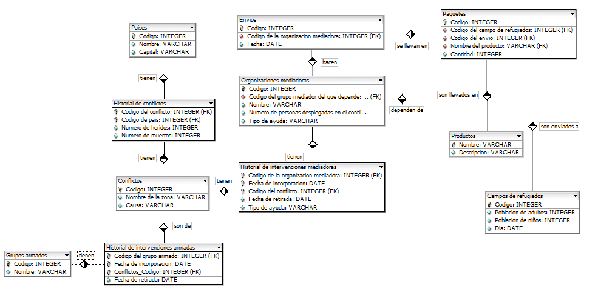

# Proyecto Base Datos

## Conflictos Bélicos

### Fase 1: [Diseño y Normalización de la Base de Datos]()

#### Una organización internacional pretende realizar un seguimiento de los conflictos bélicos que se producen en todo el mundo. Para ello creará una BD que responderá a un analisis del [enunciado](https://github.com/MoralG/Proyecto_Base_Datos/blob/master/Enunciado_Dise%C3%B1o.md#conflictos-b%C3%A9licos) de conflictos bélicos para crear el [diseño de entidad relación](https://raw.githubusercontent.com/MoralG/Proyecto_Base_Datos/master/Programa_Fase1.png).

### Fase 2: [Creación de la Base de Datos. Carga de datos]()

#### Tablas a Generar:

* Revisar si hubiera algun fallo de entidad relación y corregirlo. 
* Creación de las tablas: Los tipos de datos y el tamaño de las columnas deben ser asignados correctamente por el
alumno.
* Restricciones a incluir:

    * Todas las claves primarias, ajenas y candidatas de todas las tablas.
    * El código de un grupo armado está compuesto de una letra que será A, B o C, un
guión y entre uno y tres dígitos.
    * Las fechas de incorporación de un grupo armado a un conflicto son siempre
posteriores a Abril de 2001.
    * La causa de un conflicto será una de las siguientes: Racial, Económico, Religioso o
Desconocida.
    * Los nombres de las organizaciones se almacenarán con la inicial de cada palabra en
mayúsculas.
    * Los envíos se realizan siempre entre las ocho de la mañana y las cuatro de la tarde.
    * Cuando se introducen los datos de un nuevo conflicto el número de heridos y muertos
será 0 a no ser que se especifique lo contrario.
    * Las columnas que no puedan dejarse en blanco tendrán la correspondiente restricción
de obligatoriedad.
    * Los envíos se realizan siempre el día 1 ó 15 de cada mes.
    * El código de país incluye una letra que indica el continente y dos dígitos para indicar
el número de orden alfabético del país dentro de dicho continente.

* Carga de Datos: La carga de datos debe realizarse con datos consistentes y cumpliendo todas las
restricciones. La cantidad mínima de datos en cada una de las tablas viene detallada a
continuación:

|       Nombre Tabla                       |  Nº Mínimo Registros  |
|:----------------------------------------:|:---------------------:|
|Países                                    |     8                 |
|Conflictos                                |     9                 | 
|Grupos Armados                            |     5                 |
|Historial de Conflictos                   |     10                |
|Historial de intervenciones armadas       |     10                |
|Organizaciones mediadoras                 |     6                 |
|Historial de intervenciones mediadoras    |     10                |
|Envíos                                    |     12                |
|Paquetes                                  |     20                |
|Productos                                 |     10                |
|Campos de refugiados                      |     6                 |

### Fase 3: Explotación de la Base de Datos. Operaciones DML

#### Sobre la base de datos creada en la Fase 2, realiza las siguientes operaciones:

  1. El grupo armado que fue el primero en participar en el conflicto que suma un mayor
número de muertos y heridos hasta la fecha se ha incorporado hoy al conflicto de
causa religiosa en el que más intervenciones mediadoras se han producido por parte
de organizaciones mediadoras que no dependen de otras. Inserta el registro adecuado
mediante una consulta de datos anexados.
2. Se ha producido un acto de guerra en Kabul con el resultado de 12 muertos y 50
heridos. Dicho acto está relacionado con el conflicto en el que participa el grupo
armado “Persa”. Actualiza la base de datos mediante una consulta de actualización.
3. Muestra el número total de víctimas (muertos y heridos) que han causado los
conflictos bélicos en cada país, incluyendo los países en los que no han habido
víctimas.
4. Muestra los campos de refugiados en los que hay más niños que adultos según el
último censo efectuado a los que se hayan mandado menos de 10 litros de leche por
niño en los últimos tres meses.
5. Muestra los nombres de los conflictos en los que se han realizado intervenciones
mediadoras tanto en 2013 como en 2014 y en 2015.
6. Muestra para cada campo de refugiados el total de envíos que incluían leche en polvo
que se han realizado en los últimos seis meses.
7. Muestra los nombres de los países que están involucrados en el conflicto religioso que
lleva activo desde hace más tiempo.
8. Muestra el producto envíado en mayor cantidad en cada uno de los envíos realizados
por organizaciones mediadores dependientes de la ONU.
9. Muestra el nombre de las organizaciones mediadoras que no han realizado ningún
envío al campo de refugiados más poblado según el último censo realizado en el
mismo.
10. Crea una vista con los nombres de los grupos armados que se han retirado de todos
los conflictos en los que han participado junto con la fecha en que se retiraron del
último de ellos.

### Fase 4: Explotación de la Base de Datos mediante PL/SQL

#### Sobre la base de datos creada en la Fase 2, realiza las siguientes operaciones:

1. Escribe una función que reciba un nombre de producto, un código de campo de refugiados y dos fechas
y devuelva el número de unidades de ese producto que se ha recibido en dicho campo entre las dos
fechas. Debes controlar las siguientes excepciones: Producto Inexistente, Campo de Refugiados
Inexistente, No existe ningún envío entre las dos fechas.
2. Realiza un procedimiento que genere informes sobre los conflictos gestionando las excepciones que
consideres oportunas. El primer parámetro determinará el tipo de informe, que pueden ser los
siguientes:
Informe Tipo 1: El segundo parámetro será una causa de conflicto. Se mostrarán todos los conflictos
que se deben a dicha causa, con la siguiente información:
~~~
Causa: xxxxxxxxxxxxxx
Conflicto: xxxxxxxxx1
País1
Zona: xxxxxxx1
NumHeridos1 NumMuertos1
NumHeridosN NumMuertosN
...
PaísN
Total Heridos Conflicto: nnnnnnnnn
Total Muertos Conflicto: nnnnnnnnn
Conflicto: xxxxxxxxxx2
Zona: xxxxxxx2
....
Total Muertos Causa xxxxxxx: n,nnn,nnn
~~~
Informe Tipo 2: El segundo parámetro será un grupo armado. Se mostrarán todas las intervenciones del
citado grupo armado, con la siguiente información ordenada por fecha de incorporación al conflicto:
~~~
Grupo Armado: xxxxxxxxxxxxxx
Conflicto1
País1
FechaIncorporación
FechaRetirada
NumHeridos1 NumMuertos1
NumHeridosN NumMuertosN
...
PaísN
Conflicto2
...
FechaIncorporación
FechaRetirada
~~~
Informe Tipo 3: El segundo parámetro será un nombre de país. Se mostrarán todos los conflictos que
han afectado a dicho país, incluyendo la siguiente información:
~~~
País: xxxxxxxxxxx
Conflicto1
Zona Causa NumHeridos NumMuertos
Zona Causa NumHeridos NumMuertos
...
ConflictoN
Total Heridos País xxxxxxxx: n,nnn,nnn
Total Muertos País xxxxxxxx: n,nnn,nnn
~~~
3. Realizar un trigger que garantice que una organización mediadora con menos de diez personas
desplegadas en un conflicto no pueda ofrecer ayuda de tipo Ayuda Humanitaria.
4. Realiza un trigger que cuando una tabla alcance un múltiplo de 1000 registros realice una copia de
seguridad de la misma llamada NombreTablannnnn, donde nnnnn es el número de registros. Debes
usar el paquete de SQL dinámico para poder crear la tabla.
5. Añade una columna llamada Activo a la Tabla Grupos Armados. Valdrá Sí si el grupo está involucrado
actualmente en algún conflicto y No en caso contrario. Rellénala con un procedimiento y mantenla
actualizada automáticamente en función de los cambios que sufra la tabla Historial de Intervenciones
Armadas.
6. Realizar los módulos de programación necesarios para garantizar que no se envían a un campo de
refugiados más de 10000 unidades de ningún producto en menos de un mes.
7. Realizar los módulos de programación necesarios para garantizar que los diferentes periodos de
intervención de un grupo armado en un conflicto no se solapan entre ellos.
8. Realizar los módulos de programación necesarios para garantizar que entre dos días consecutivos la
población total de un campo de refugiados no decrece en más de un 60%
