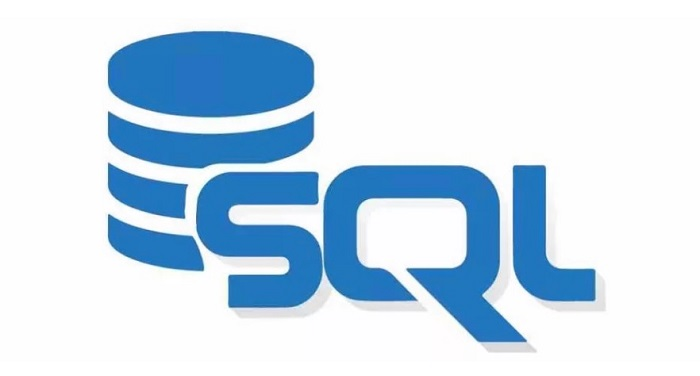

# Proyecto Base Datos. Conflictos Bélicos

## Fase 1: Diseño y Normalización de la Base de Datos

* #### Una organización internacional pretende realizar un seguimiento de los conflictos bélicos que se producen en todo el mundo. Para ello creará una BD que responderá a un analisis del enunciado de conflictos bélicos para crear el diseño de entidad relación.

    * [Enunciado](https://github.com/MoralG/Proyecto_Base_Datos/blob/master/fase1/Enunciado_Dise%C3%B1o.md#conflictos-b%C3%A9licos)
    * [Diseño y Normalización de la Base de Datos](https://github.com/MoralG/Proyecto_Base_Datos/blob/master/Fase1_Dise%C3%B1o.md#fase-1-dise%C3%B1o-y-normalizaci%C3%B3n-de-la-base-de-datos)
    * [Imagen png del diseño completo de entidad relación](https://raw.githubusercontent.com/MoralG/Proyecto_Base_Datos/master/fase1/Programa_Fase1.png).
    * [Fichero xml del diseño entidad relación](https://github.com/MoralG/Proyecto_Base_Datos/blob/master/fase1/Programa_Fase1.xml)

## Fase 2: Creación de la Base de Datos. Carga de datos

* **Creación de las tablas y Restricciones:** Los tipos de datos y el tamaño de las columnas deben ser asignados correctamente por el alumno.
    * [ORACLE](https://github.com/MoralG/Proyecto_Base_Datos/blob/master/Fase2_Oracle_Creacion_Inserci%C3%B3n.md#creaci%C3%B3n-de-tablas-y-restrincciones)
    * [POSTGRES](https://github.com/MoralG/Proyecto_Base_Datos/blob/master/Fase2_Postgres_Creacion_Inserci%C3%B3n.md#creaci%C3%B3n-de-tablas-y-restrincciones)
    * [MYSQL](https://github.com/MoralG/Proyecto_Base_Datos/blob/master/Fase2_MySQL_Creacion_Inserci%C3%B3n.md#creaci%C3%B3n-de-tablas-y-restrincciones)

* **Carga de Datos:** La carga de datos debe realizarse con datos consistentes y cumpliendo todas las restricciones.
    * [ORACLE](https://github.com/MoralG/Proyecto_Base_Datos/blob/master/Fase2_Oracle_Creacion_Inserci%C3%B3n.md#inserci%C3%B3n-de-datos)
    * [POSTGRES](https://github.com/MoralG/Proyecto_Base_Datos/blob/master/Fase2_Postgres_Creacion_Inserci%C3%B3n.md#inserci%C3%B3n-de-datos)
    * [MYSQL](https://github.com/MoralG/Proyecto_Base_Datos/blob/master/Fase2_MySQL_Creacion_Inserci%C3%B3n.md#inserci%C3%B3n-de-datos)

## Fase 3: Explotación de la Base de Datos. Operaciones DML

#### Sobre la base de datos creada en la Fase 2, realiza las siguientes operaciones:

* **Tarea 1**. Inserta el registro adecuado mediante una consulta de datos anexados.
    * [ORACLE](https://github.com/MoralG/Proyecto_Base_Datos/blob/master/Fase3_Oracle_Consultas.md#tarea-1)
    * [POSTGRES](https://github.com/MoralG/Proyecto_Base_Datos/blob/master/Fase3_Postgres_Consultas.md#tarea-1)
    * [MYSQL](https://github.com/MoralG/Proyecto_Base_Datos/blob/master/Fase3_MySQL_Consultas.md#tarea-1)
* **Tarea 2**. Actualiza la base de datos mediante una consulta de actualización.
    * [ORACLE](https://github.com/MoralG/Proyecto_Base_Datos/blob/master/Fase3_Oracle_Consultas.md#tarea-2)
    * [POSTGRES](https://github.com/MoralG/Proyecto_Base_Datos/blob/master/Fase3_Postgres_Consultas.md#tarea-2)
    * [MYSQL](https://github.com/MoralG/Proyecto_Base_Datos/blob/master/Fase3_MySQL_Consultas.md#tarea-2)
* **Tarea 3**. Muestra el número total de víctimas (muertos y heridos) que han causado los conflictos bélicos en cada país, incluyendo los países en los que no han habido víctimas.
    * [ORACLE](https://github.com/MoralG/Proyecto_Base_Datos/blob/master/Fase3_Oracle_Consultas.md#tarea-3)
    * [POSTGRES](https://github.com/MoralG/Proyecto_Base_Datos/blob/master/Fase3_Postgres_Consultas.md#tarea-3)
    * [MYSQL](https://github.com/MoralG/Proyecto_Base_Datos/blob/master/Fase3_MySQL_Consultas.md#tarea-3)
* **Tarea 4**. Muestra los campos de refugiados en los que hay más niños que adultos según el último censo efectuado a los que se hayan mandado menos de 10 litros de leche por niño en los últimos tres meses.
    * [ORACLE](https://github.com/MoralG/Proyecto_Base_Datos/blob/master/Fase3_Oracle_Consultas.md#tarea-4)
    * [POSTGRES](https://github.com/MoralG/Proyecto_Base_Datos/blob/master/Fase3_Postgres_Consultas.md#tarea-4)
    * [MYSQL](https://github.com/MoralG/Proyecto_Base_Datos/blob/master/Fase3_MySQL_Consultas.md#tarea-4)
* **Tarea 5**. Muestra los nombres de los conflictos en los que se han realizado intervenciones mediadoras tanto en 2013 como en 2014 y en 2015.
    * [ORACLE](https://github.com/MoralG/Proyecto_Base_Datos/blob/master/Fase3_Oracle_Consultas.md#tarea-5)
    * [POSTGRES](https://github.com/MoralG/Proyecto_Base_Datos/blob/master/Fase3_Postgres_Consultas.md#tarea-5)
    * [MYSQL](https://github.com/MoralG/Proyecto_Base_Datos/blob/master/Fase3_MySQL_Consultas.md#tarea-5)
* **Tarea 6**. Muestra para cada campo de refugiados el total de envíos que incluían leche en polvo que se han realizado en los últimos seis meses.
    * [ORACLE](https://github.com/MoralG/Proyecto_Base_Datos/blob/master/Fase3_Oracle_Consultas.md#tarea-6)
    * [POSTGRES](https://github.com/MoralG/Proyecto_Base_Datos/blob/master/Fase3_Postgres_Consultas.md#tarea-6)
    * [MYSQL](https://github.com/MoralG/Proyecto_Base_Datos/blob/master/Fase3_MySQL_Consultas.md#tarea-6)
* **Tarea 7**. Muestra los nombres de los países que están involucrados en el conflicto religioso que lleva activo desde hace más tiempo.
    * [ORACLE](https://github.com/MoralG/Proyecto_Base_Datos/blob/master/Fase3_Oracle_Consultas.md#tarea-7)
    * [POSTGRES](https://github.com/MoralG/Proyecto_Base_Datos/blob/master/Fase3_Postgres_Consultas.md#tarea-7)
    * [MYSQL](https://github.com/MoralG/Proyecto_Base_Datos/blob/master/Fase3_MySQL_Consultas.md#tarea-7)
* **Tarea 8**. Muestra el producto envíado en mayor cantidad en cada uno de los envíos realizados por organizaciones mediadores dependientes de la ONU.
    * [ORACLE](https://github.com/MoralG/Proyecto_Base_Datos/blob/master/Fase3_Oracle_Consultas.md#tarea-8)
    * [POSTGRES](https://github.com/MoralG/Proyecto_Base_Datos/blob/master/Fase3_Postgres_Consultas.md#tarea-8)
    * [MYSQL](https://github.com/MoralG/Proyecto_Base_Datos/blob/master/Fase3_MySQL_Consultas.md#tarea-8)
* **Tarea 9**. Muestra el nombre de las organizaciones mediadoras que no han realizado ningún envío al campo de refugiados más poblado según el último censo realizado en el mismo.
    * [ORACLE](https://github.com/MoralG/Proyecto_Base_Datos/blob/master/Fase3_Oracle_Consultas.md#tarea-9)
    * [POSTGRES](https://github.com/MoralG/Proyecto_Base_Datos/blob/master/Fase3_Postgres_Consultas.md#tarea-9)
    * [MYSQL](https://github.com/MoralG/Proyecto_Base_Datos/blob/master/Fase3_MySQL_Consultas.md#tarea-9)
* **Tarea 10**. Crea una vista con los nombres de los grupos armados que se han retirado de todos los conflictos en los que han participado junto con la fecha en que se retiraron del último de ellos.
    * [ORACLE](https://github.com/MoralG/Proyecto_Base_Datos/blob/master/Fase3_Oracle_Consultas.md#tarea-10)
    * [POSTGRES](https://github.com/MoralG/Proyecto_Base_Datos/blob/master/Fase3_Postgres_Consultas.md#tarea-10)
    * [MYSQL](https://github.com/MoralG/Proyecto_Base_Datos/blob/master/Fase3_MySQL_Consultas.md#tarea-10)
 

## Fase 4: Explotación de la Base de Datos mediante PL/SQL

#### Sobre la base de datos creada en la Fase 2, realiza las siguientes operaciones:

* **Tarea 1**. Escribe una función que reciba un nombre de producto, un código de campo de refugiados y dos fechas y devuelva el número de unidades de ese producto que se ha recibido en dicho campo entre las dos fechas.
    * [ORACLE](https://github.com/MoralG/Proyecto_Base_Datos/blob/master/Fase4_Oracle_PL-SQL.md#tarea-1)
    * [POSTGRES](https://github.com/MoralG/Proyecto_Base_Datos/blob/master/Fase4_Postgres_PL-SQL.md#tarea-1)

* **Tarea 2**. Realiza un procedimiento que genere informes sobre los conflictos gestionando las excepciones que consideres oportunas.
    * [ORACLE](https://github.com/MoralG/Proyecto_Base_Datos/blob/master/Fase4_Oracle_PL-SQL.md#tarea-2)

* **Tarea 3**. Realizar un trigger que garantice que una organización mediadora con menos de diez personas desplegadas en un conflicto no pueda ofrecer ayuda de tipo Ayuda Humanitaria.
    * [ORACLE](https://github.com/MoralG/Proyecto_Base_Datos/blob/master/Fase4_Oracle_PL-SQL.md#tarea-3)
    * [POSTGRES](https://github.com/MoralG/Proyecto_Base_Datos/blob/master/Fase4_Postgres_PL-SQL.md#tarea-3)

* **Tarea 4**. Realizar los módulos de programación necesarios para garantizar que los diferentes periodos de intervención de un grupo armado en un conflicto no se solapan entre ellos.
    * [ORACLE](https://github.com/MoralG/Proyecto_Base_Datos/blob/master/Fase4_Oracle_PL-SQL.md#tarea-4)

* **Tarea 5**. Realizar los módulos de programación necesarios para garantizar que un grupo armado no ha estado en mas de 5 conflictos en el mismo año.
    * [ORACLE](https://github.com/MoralG/Proyecto_Base_Datos/blob/master/Fase4_Oracle_PL-SQL.md#tarea-5)